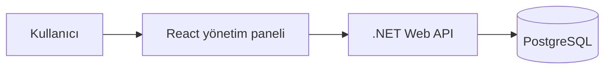

# Beauty Salon Management System

Güzellik salonlarının müşteri ilişkilerini ve günlük operasyonlarını tek noktadan yönetebilmesi için geliştirdiğim full-stack bir yönetim sistemidir. Proje; randevudan ödemeye, hizmet takibinden raporlamaya kadar birbirine bağlı birçok iş sürecini bütüncül bir yapıda ele alır.

## Temel özellikler

- Müşteri kayıtları ve işlem geçmişi
- Randevu planlama ve durum takibi
- Hizmet ve hizmet kategorisi yönetimi
- Ödeme ve gider kayıtları
- Lazer ve bölgesel incelme seanslarının takibi
- Kullanıcı ve rol yönetimi
- Dashboard, rapor ve grafik ekranları

## Mimari

Uygulama, React tabanlı bir yönetim paneli ile .NET 8 üzerinde çalışan REST API'den oluşur. Frontend kullanıcı deneyimini ve operasyon ekranlarını yönetirken backend iş kurallarını, veri işlemlerini ve yetkilendirme süreçlerini yürütür. Veriler PostgreSQL üzerinde ilişkisel olarak saklanır.



Frontend tarafında sayfa ve bileşen odaklı bir yapı kullanıldı; API iletişimi ortak bir katmanda toplandı. Backend tarafında ise sorumlulukları ayrılmış controller, servis, veri erişimi ve model katmanları tercih edildi. Bu yapı, yeni operasyonların mevcut sistemi bozmadan eklenebilmesini kolaylaştırır.

## Kullanılan teknolojiler

| Alan | Teknolojiler |
| --- | --- |
| Backend | .NET 8, ASP.NET Core Web API, Entity Framework Core |
| Frontend | React 19, React Router, Axios |
| Veritabanı | PostgreSQL |
| Arayüz ve raporlama | Tailwind CSS, Chart.js, React Hot Toast |
| API dokümantasyonu | Swagger / OpenAPI |
| Dağıtım | Docker, Railway |

## Projede ele aldığım konular

Bu proje üzerinde çalışırken yalnızca ekran geliştirmeye değil, gerçek bir işletmenin birbiriyle ilişkili süreçlerini doğru biçimde modellemeye odaklandım.

- Full-stack uygulama geliştirme
- İlişkisel veri modelleme
- Rol bazlı kullanıcı deneyimi
- Form, tablo ve raporlama ekranları
- Frontend ile REST API entegrasyonu
- Üretim ortamına uygun yapılandırma ve dağıtım
- Bakımı ve geliştirilmesi kolay proje organizasyonu

## Proje yapısı

```
BeautySalonAPI/          .NET Web API
beauty-salon-frontend/   React yönetim paneli
Dockerfile               Container yapılandırması
railway.toml             Dağıtım yapılandırması
```

## Proje hakkında

Beauty Salon Management System, tek bir CRUD uygulamasından daha geniş kapsamlıdır. Farklı kullanıcıların müşteri, randevu, hizmet, seans ve finans süreçlerini aynı sistem içinde yönetebilmesini sağlayan, gerçek kullanım senaryolarına göre tasarlanmış bir yönetim uygulamasıdır.

- .NET 8 SDK
- Node.js ve npm
- PostgreSQL
