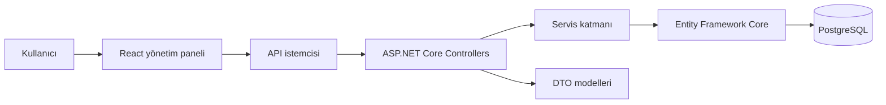

# Beauty Salon Management System

Beauty Salon Management System, güzellik salonlarının günlük operasyonlarını tek bir sistem üzerinden yönetebilmesi için geliştirilmiş full-stack bir uygulamadır. Müşteri ve randevu yönetiminin yanında ödeme, gider, hizmet, kullanıcı ve seans süreçlerini de kapsar.

Proje; salon çalışanlarının günlük işlemleri hızlıca yürütebileceği bir yönetim paneli ile bu işlemleri güvenli ve düzenli biçimde yöneten bir REST API'den oluşur.

## Özellikler

### Müşteri ve randevu yönetimi

- Müşteri kayıtlarını oluşturma ve güncelleme
- Müşterilerin geçmiş işlemlerini görüntüleme
- Randevu oluşturma, düzenleme ve takip etme
- Randevu durumlarını yönetme

### Hizmet ve seans takibi

- Hizmetleri ve hizmet kategorilerini yönetme
- Müşterilere ait hizmet paketlerini takip etme
- Lazer epilasyon seanslarını kaydetme
- Bölgesel incelme seanslarını takip etme
- Tamamlanan ve kalan seansları görüntüleme

### Finansal işlemler

- Ödeme kayıtlarını yönetme
- Giderleri kategorileriyle birlikte takip etme
- Dashboard ve rapor ekranlarından salonun genel durumunu inceleme
- Grafiklerle özet verileri görüntüleme

### Kullanıcı ve yetkilendirme

- JWT tabanlı kullanıcı girişi
- Kullanıcı ve rol yönetimi
- Yetki gerektiren sayfaları koruma
- Belirli yönetim ekranlarını yalnızca ilgili rollere açma

## Mimari

Uygulama, birbirinden ayrılmış bir React istemcisi ve ASP.NET Core Web API üzerine kuruludur. Frontend kullanıcı arayüzünü ve oturum akışını yönetirken backend iş kurallarını, kimlik doğrulamayı ve veritabanı işlemlerini yürütür.



### Frontend mimarisi

Frontend, React ile geliştirilmiş tek sayfalı bir uygulamadır. Sayfalar React Router üzerinden yönetilir. Kullanıcının oturum bilgisi `AuthContext` içinde tutulur; korunan sayfalara erişim `ProtectedRoute` bileşeni üzerinden kontrol edilir.

API istekleri ortak bir istemci katmanında toplanmıştır. Böylece sayfalar doğrudan HTTP ayrıntılarıyla uğraşmak yerine ihtiyaç duydukları işlemleri merkezi API fonksiyonları üzerinden gerçekleştirir.

Arayüz tarafındaki temel ayrım şöyledir:

- `pages/`: Dashboard, müşteriler, randevular, ödemeler, raporlar ve diğer ana ekranlar
- `components/`: Ortak arayüz bileşenleri, yerleşim ve yetki kontrolleri
- `contexts/`: Kullanıcı oturumu ve kimlik doğrulama durumu
- `api/`: Backend ile iletişim kuran ortak API katmanı
- `styles/`: Uygulama genelinde kullanılan stil ve tema dosyaları

### Backend mimarisi

Backend, .NET 8 üzerinde çalışan ASP.NET Core Web API'dir. Her iş alanı için ayrı controller bulunur. İstemciden alınan ve istemciye döndürülen veriler DTO modelleriyle ayrıştırılır; veritabanı varlıkları doğrudan dışarı açılmaz.

Backend tarafındaki temel katmanlar:

- `Controllers/`: HTTP isteklerini karşılayan API uçları
- `DTOs/`: İstek ve yanıt modelleri
- `Services/`: Kimlik doğrulama gibi iş kurallarını yöneten servisler
- `Entities/`: Veritabanındaki temel alan modelleri
- `Data/`: Entity Framework Core veritabanı bağlamı
- `Migrations/`: Veritabanı şemasının sürüm geçmişi

Entity Framework Core, uygulama ile PostgreSQL arasındaki veri erişimini yönetir. Veritabanı migrasyonları uygulama başlarken otomatik olarak uygulanır. Kimlik doğrulama JWT Bearer üzerinden gerçekleştirilir ve parolalar BCrypt ile güvenli biçimde işlenir.

### Dağıtım yapısı

Proje Docker ve Railway üzerinde çalışabilecek şekilde yapılandırılmıştır. Backend, üretim ortamında `wwwroot` klasörüne yerleştirilen React çıktısını statik dosya olarak sunabilir. Böylece frontend ve API istenirse tek servis üzerinden yayınlanabilir.

## Kullanılan teknolojiler

| Alan | Teknolojiler |
| --- | --- |
| Backend | .NET 8, ASP.NET Core Web API, Entity Framework Core |
| Frontend | React 19, React Router, Axios |
| Veritabanı | PostgreSQL |
| Güvenlik | JWT Bearer Authentication, BCrypt |
| Arayüz | CSS, Tailwind CSS, React Hot Toast, Lucide React |
| Raporlama | Chart.js, React Chart.js 2 |
| Dokümantasyon | Swagger / OpenAPI |
| Dağıtım | Docker, Railway |

## Proje yapısı

```
.
├── BeautySalonAPI/
│   ├── Controllers/
│   ├── DTOs/
│   ├── Data/
│   ├── Entities/
│   ├── Migrations/
│   ├── Services/
│   └── Program.cs
├── beauty-salon-frontend/
│   └── src/
│       ├── api/
│       ├── components/
│       ├── contexts/
│       ├── pages/
│       ├── styles/
│       └── utils/
├── Dockerfile
└── railway.toml
```

## Kurulum

### Gereksinimler

- .NET 8 SDK
- Node.js ve npm
- PostgreSQL
